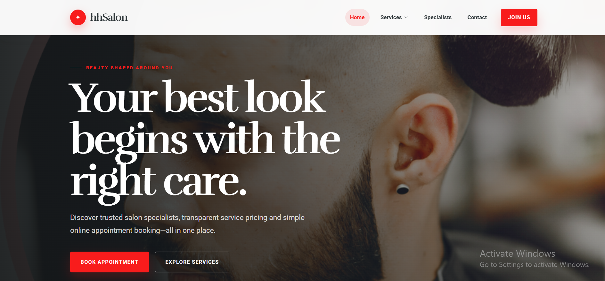
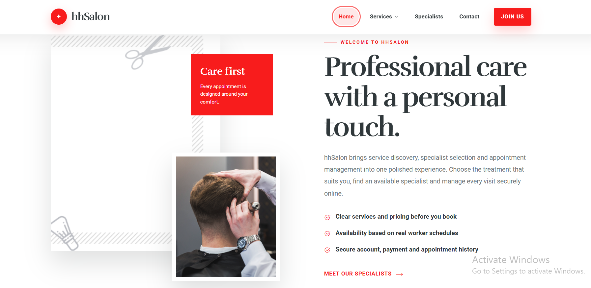
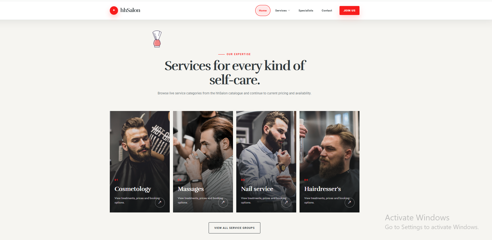
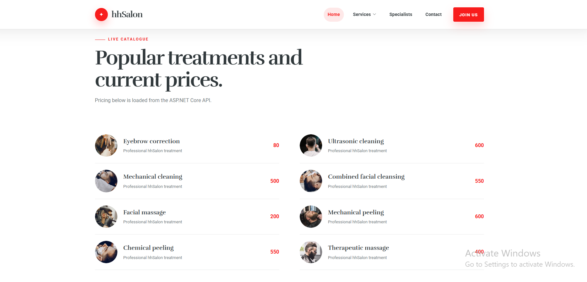
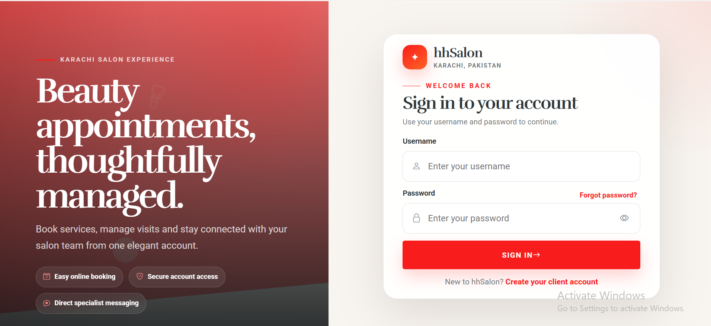
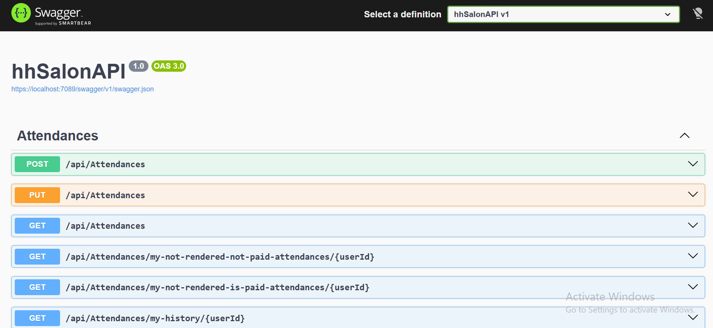

<h1 align="center">✂️ HH Salon — Hair &amp; Health Salon</h1>

<p align="center">
  <b>A secure, responsive, portfolio-ready salon management platform built with ASP.NET Core 10 Web API, Angular 22, TypeScript, Entity Framework Core, MySQL/MariaDB, secure JWT cookies, SignalR, PayPal, and SCSS.</b>
</p>

<p align="center">
  
  
  
  
  
  
  
</p>

---

## 📸 Project Screenshots

| Home Page | About |
|---|---|
|  |  |

| Services | Packages  |
|---|---|
|  |  |

| Login | Swagger API |
|---|---|
|  |  |

---

## 🚀 Project Overview

**Hair & Health Salon**, is a full-stack salon management application designed to demonstrate practical ASP.NET Core and Angular development in a secure, maintainable, and responsive solution.

The public website presents the salon, service categories, prices, specialists, packages, and Karachi contact information through a premium theme-inspired interface. Registered users can access role-specific workflows for appointment booking, profile management, worker schedules, administration, payments, and real-time messaging.

The backend is an **ASP.NET Core 10 REST API** backed by MySQL or MariaDB through Entity Framework Core. The frontend is a standalone **Angular 22 + TypeScript** application using lazy-loaded routes, reactive forms, RxJS, SignalR, SCSS, Bootstrap Icons, and secure cookie-based authentication.

---

## 🎯 Project Purpose

This project demonstrates junior-to-intermediate full-stack engineering with:

- ASP.NET Core 10 REST API development
- Angular 22 standalone architecture
- TypeScript, RxJS, reactive forms, and lazy routing
- MySQL/MariaDB and Entity Framework Core
- JWT access and refresh tokens in secure HTTP-only cookies
- Role-based authorization for Admin, Worker, and Client accounts
- Appointment booking and worker schedule workflows
- Service-category and price management
- PayPal Sandbox payment integration
- SignalR private chat and read receipts
- SMTP-based password-reset support
- Responsive mobile, tablet, laptop, desktop, and large-screen layouts
- Swagger/OpenAPI documentation
- Rate limiting for authentication, payments, and chat
- NUnit backend test infrastructure and Vitest frontend regression tests
- Secret-safe local configuration through .NET User Secrets

---

## ⭐ Key Highlights

- Premium responsive Hair & Health Salon interface
- Public service catalogue populated from the database
- Six seeded service groups and twenty-five seeded services
- Secure username-and-password authentication
- Short-lived JWT access token and rotating refresh token
- Secure, HTTP-only, SameSite cookies
- Automatic session refresh through an Angular HTTP interceptor
- Admin, Worker, and Client authorization boundaries
- Admin management of users, workers, service groups, services, schedules, and appointments
- Client appointment creation, upcoming appointments, history, cancellation, and payment
- Worker appointment queue, status updates, history, profile, and schedule management
- SignalR private chat with automatic reconnection and read state
- PayPal order creation and capture with server-side amount verification
- SMTP password-reset workflow
- Strong password validation
- API conflict, validation, unauthorized, forbidden, empty, and loading states
- Responsive tables on desktop and card layouts on mobile
- Swagger/OpenAPI documentation in Development
- GitHub Actions workflow for backend and frontend validation
- Seven passing frontend regression tests
- Zero npm vulnerabilities at the verified development snapshot

---

## ✨ Features

### 🌐 Public Website

| Feature | Description |
|---|---|
| Home | Premium responsive landing page with service and specialist content |
| About | Brand and salon overview |
| Service groups | Loads service categories from the API |
| Service catalogue | Displays database-backed services and prices by category |
| Workers | Displays registered salon specialists |
| Packages | Presents premium salon package content |
| Contact | Shows dummy Karachi address, phone details, and responsive map |
| Join Us | Directs visitors to Client registration |

### 🔐 Authentication and Account Management

| Feature | Description |
|---|---|
| Registration | Creates a Client account with validated personal information |
| Secure login | Authenticates using username and password |
| Access token | Short-lived JWT stored in a secure HTTP-only cookie |
| Refresh token | Rotating hashed refresh token stored through a secure cookie |
| Automatic refresh | Retries eligible unauthorized requests after one refresh operation |
| Logout | Clears authentication cookies and local session metadata |
| Password reset | Sends and validates password-reset tokens when SMTP is configured |
| Profile editing | Allows authenticated users to update permitted profile fields |
| Role state | Restores ID, username, full name, and role for navigation decisions |

### ✂️ Services and Workers

| Feature | Description |
|---|---|
| Service groups | Admin creates, updates, and removes salon categories |
| Services | Admin manages service names and prices |
| Service mapping | Services are associated with their relevant group |
| Worker creation | Admin creates Worker accounts and assigns service groups |
| Worker listing | Publicly displays registered specialists |
| Worker profile | Worker or Admin updates permitted worker information |
| Worker schedule | Admin or authorized Worker manages weekday availability |
| Group filtering | Booking workflow finds Workers supporting a selected service group |

### 📅 Appointments

| Feature | Description |
|---|---|
| Guided booking | Client selects service, Worker, date, and available time slot |
| Slot availability | Loads free Worker times from the API |
| Duplicate protection | Backend constraints prevent conflicting bookings |
| Client upcoming list | Shows paid and unpaid future appointments |
| Client history | Shows historical or rendered appointments |
| Worker queue | Shows appointments assigned to the authenticated Worker |
| Worker status | Worker marks appointments rendered or not rendered |
| Admin management | Admin searches, reviews, updates, and deletes eligible appointments |
| Responsive presentation | Desktop tables and mobile cards with intentional empty states |

### 💳 Payments

| Feature | Description |
|---|---|
| PayPal configuration | Loads public Sandbox Client ID and currency |
| Order creation | Creates an order for Client-owned eligible appointments |
| Amount validation | Backend independently verifies appointment totals |
| Order capture | Captures approved PayPal orders |
| Reservation protection | Prevents conflicting payment attempts |
| Transaction storage | Stores provider order, payer, amount, currency, and status data |

### 💬 Real-Time Chat

| Feature | Description |
|---|---|
| Authenticated SignalR hub | Limits messaging to authenticated users |
| Private messages | Sends messages to the selected contact |
| Message persistence | Stores chat messages in MySQL/MariaDB |
| Read state | Marks messages as read |
| Contact list | Displays users with recent conversation context |
| Reconnection | SignalR client reconnects automatically |
| Rate limiting | Restricts excessive connections and message traffic |

---

## 🛠 Technology Stack

### ⚙️ Backend

| Area | Technology |
|---|---|
| Runtime | .NET 10 |
| Language | C# |
| Framework | ASP.NET Core 10 Web API |
| Authentication | JWT Bearer with secure HTTP-only access and refresh cookies |
| Authorization | Admin, Worker, Client, ownership checks, and route policies |
| ORM | Entity Framework Core 10 |
| Database provider | `MySql.EntityFrameworkCore` |
| Database | MySQL or MariaDB |
| Real-time communication | ASP.NET Core SignalR |
| Email | MailKit SMTP |
| Payments | PayPal REST API |
| API documentation | Swagger / OpenAPI |
| Rate limiting | ASP.NET Core fixed-window rate limiters |
| Testing | NUnit, ASP.NET Core Test Host, EF Core InMemory, SQLite, and MySQL constraints |

### 🎨 Frontend

| Area | Technology |
|---|---|
| Framework | Angular 22.0.7 |
| Language | TypeScript 6.0.3 |
| Architecture | Standalone bootstrap and lazy-loaded standalone routes |
| Forms | Angular Reactive Forms |
| HTTP | Angular HttpClient with credentials and refresh interceptor |
| Reactive programming | RxJS 7.8.2 |
| Real-time client | Microsoft SignalR 10.0.0 |
| Styling | SCSS, premium design tokens, responsive layouts |
| Fonts | Rufina and Roboto |
| Icons | Bootstrap Icons |
| Notifications | Toastr legacy bridge |
| Testing | Vitest 4.1.10 |
| Development HTTPS | Trusted localhost certificate through `npm run setup:https` |

---

## 🏗 Architecture Overview

```text
Browser
   |
   v
Angular 22 + TypeScript
   |
   +--> Angular HttpClient -------- HTTPS REST API
   |
   +--> SignalR Client ----------- Private Chat Hub
                                      |
                                      v
                              ASP.NET Core 10 API
                                      |
                         Authentication / Authorization
                                      |
                           Controllers and Validation
                                      |
                             Application Services
                                      |
                          Repositories / EF Core 10
                                      |
                                      v
                              MySQL / MariaDB
```

### Layer Responsibilities

| Project | Responsibility |
|---|---|
| `hhSalon/hhSalonAPI/hhSalonAPI` | API controllers, authentication, authorization, PayPal, SignalR, Swagger, rate limiting, startup, and secure Admin bootstrap |
| `hhSalon/hhSalonAPI/hhSalon.Services` | Application services, DTOs, view models, email, and chat business logic |
| `hhSalon/hhSalonAPI/hhSalon.Domain` | Entities, DbContext, configurations, repositories, migrations, and starter-data seeding |
| `hhSalon/hhSalonAPI/hhSalon.Tests` | Controller, authorization, authentication, database-integrity, and security tests |
| `hhSalon/hhSalon.UI` | Angular layouts, routes, API clients, guards, forms, responsive pages, SignalR client, and shared styling |
| `docs/screenshots` | Portfolio screenshots used by this README |

### Authentication Flow

```text
User submits username and password
              |
              v
API verifies the stored password hash
              |
              v
API issues JWT access and rotating refresh tokens
              |
              +--> Access token: Secure HttpOnly cookie
              |
              +--> Refresh token: Secure HttpOnly cookie
              |
              v
Angular sends API requests with credentials
              |
              v
401 response triggers one queued refresh request
              |
              v
Original request is retried or the session is cleared
```

### Appointment Data Flow

```text
Client selects service group and service
              |
              v
Angular requests eligible Workers
              |
              v
Client selects Worker and date
              |
              v
API returns available schedule slots
              |
              v
Client submits appointment
              |
              v
Backend validates ownership, service group, date, time, and duplicates
              |
              v
Entity Framework Core stores the appointment in MySQL/MariaDB
```

---

## 🔐 Security and Reliability

| Area | Implementation |
|---|---|
| Password storage | Salted password hashing through the backend password helper |
| Password policy | Minimum eight characters with uppercase, lowercase, number, and symbol |
| Access token | Signed JWT with issuer, audience, expiry, and identifier claims |
| Refresh token | Random token stored as a database hash with expiration and rotation |
| Cookies | Secure, HTTP-only, SameSite Strict, and path-scoped |
| Frontend storage | Stores only non-sensitive session metadata in `sessionStorage` |
| Authorization | Role attributes plus ownership validation inside controllers |
| CORS | Explicit frontend origins with credentials enabled |
| Payment validation | Server recalculates totals and checks appointment ownership |
| Rate limiting | Authentication, payment, chat messages, and hub connections |
| Chat | Authenticated hub and server-side sender identity |
| Secrets | Connection string, JWT key, SMTP, PayPal, and initial Admin password remain outside Git |
| Validation | API validation plus Angular reactive-form feedback |
| Database integrity | Unique constraints protect usernames, emails, schedules, and appointment slots |
| HTTPS | Trusted localhost certificates for API and Angular development |
| Testing | Frontend regression tests and backend security/integrity test project |

---

## 🗃 Database Model

### Main Tables

| Table | Purpose |
|---|---|
| `users` | Authentication, roles, profile fields, and refresh-token metadata |
| `workers` | Worker-specific profile linked to a User |
| `groups_of_services` | Salon service categories |
| `services` | Individual services and prices |
| `services_groups` | Service-to-category mappings |
| `workers_groups` | Worker-to-category mappings |
| `schedules` | Worker availability by weekday |
| `attendances` | Client appointments |
| `chats` | Persistent private messages |
| `paymenttransactions` | PayPal orders, captures, reservations, and statuses |
| `__efmigrationshistory` | Applied Entity Framework Core migrations |

### Starter Data

When `Database:SeedOnStartup` is enabled and the relevant tables are empty, the backend inserts:

```text
6 service groups
25 services
25 service-group mappings
```

Seeded groups:

- Cosmetology
- Massages
- Nail service
- Hairdresser's
- Makeup
- Depilation

The repository does **not** seed:

- Default usernames or passwords
- Workers
- Worker schedules
- Client accounts
- Appointments
- Chat messages
- Payment transactions

---

## 📁 Repository Structure

```text
hair-health-salon-dotnet-angular/
├── .github/
│   └── workflows/
│       └── ci.yml
├── docs/
│   └── screenshots/
│       ├── about.png
│       ├── home.png
│       ├── login.png
│       ├── packages.png
│       ├── services.png
│       └── swagger.png
├── hhSalon/
│   ├── global.json
│   ├── hhSalon.UI/
│   │   ├── src/
│   │   │   ├── app/
│   │   │   │   ├── components/
│   │   │   │   ├── layouts/
│   │   │   │   ├── models/
│   │   │   │   ├── services/
│   │   │   │   └── app.routes.ts
│   │   │   ├── assets/
│   │   │   ├── environments/
│   │   │   ├── fonts/
│   │   │   └── sass/
│   │   ├── tools/
│   │   ├── angular.json
│   │   ├── package.json
│   │   └── package-lock.json
│   └── hhSalonAPI/
│       ├── hhSalon.Domain/
│       ├── hhSalon.Services/
│       ├── hhSalon.Tests/
│       ├── hhSalonAPI/
│       └── hhSalonAPI.sln
├── .gitattributes
├── .gitignore
├── LICENSE
└── README.md
```

---

## ⚙️ Installation Guide — Windows PowerShell

### Requirements

- Windows 10 or Windows 11
- PowerShell 5.1 or PowerShell 7+
- .NET SDK 10.0.302 or a compatible .NET 10 SDK
- Node.js 22.22.3+
- npm 10+
- MySQL or MariaDB
- Git
- Optional: XAMPP for local MariaDB/MySQL management
- Optional: PayPal Sandbox developer account
- Optional: SMTP account for password-reset emails

Verify:

```powershell
dotnet --list-sdks
node --version
npm --version
git --version
```

### 1. Clone the Repository

```powershell
git clone https://github.com/YOUR_GITHUB_USERNAME/hair-health-salon-dotnet-angular.git
Set-Location '.\hair-health-salon-dotnet-angular'

$RepoRoot = (Get-Location).Path
$SolutionRoot = Join-Path $RepoRoot 'hhSalon'
$ApiSolution = Join-Path $SolutionRoot 'hhSalonAPI'
$ApiProject = Join-Path $ApiSolution 'hhSalonAPI'
$Frontend = Join-Path $SolutionRoot 'hhSalon.UI'
```

### 2. Select the .NET 10 SDK

The repository contains `global.json`.

When .NET 10 is installed for the current user:

```powershell
$DotNet = "$env:USERPROFILE\.dotnet\dotnet.exe"
$env:DOTNET_ROOT = "$env:USERPROFILE\.dotnet"
$env:Path = "$env:USERPROFILE\.dotnet;$env:USERPROFILE\.dotnet\tools;$env:Path"
```

Otherwise:

```powershell
$DotNet = (Get-Command dotnet).Source
```

Verify:

```powershell
& $DotNet --version
```

### 3. Start MySQL or MariaDB

For XAMPP:

```powershell
if (Test-Path 'C:\xampp\xampp-control.exe') {
    Start-Process 'C:\xampp\xampp-control.exe'
}
```

Start MySQL from the XAMPP Control Panel.

Optional CLI verification:

```powershell
$MySqlExe = 'C:\xampp\mysql\bin\mysql.exe'

& $MySqlExe `
    --host=127.0.0.1 `
    --port=3306 `
    --user=root `
    --password= `
    --execute 'SELECT VERSION() AS server_version;'
```

### 4. Configure .NET User Secrets

```powershell
Set-Location $ApiProject

$ApiProjectFile = Join-Path $ApiProject 'hhSalonAPI.csproj'
$ConnectionString = 'server=127.0.0.1;port=3306;database=hhSalon;user=root;password=;SslMode=Disabled'

& $DotNet user-secrets set `
    'ConnectionStrings:DefaultConnectionString' `
    $ConnectionString `
    --project $ApiProjectFile
```

Generate a random JWT signing key:

```powershell
$JwtBytes = New-Object byte[] 64
$RandomGenerator = [System.Security.Cryptography.RandomNumberGenerator]::Create()
$RandomGenerator.GetBytes($JwtBytes)
$RandomGenerator.Dispose()
$JwtKey = [Convert]::ToBase64String($JwtBytes)

& $DotNet user-secrets set `
    'Jwt:Key' `
    $JwtKey `
    --project $ApiProjectFile

Remove-Variable JwtBytes, RandomGenerator, JwtKey
```

Configure seed behavior:

```powershell
& $DotNet user-secrets set `
    'Database:SeedOnStartup' `
    'true' `
    --project $ApiProjectFile
```

Do not publish `dotnet user-secrets list` output because it reveals values.

### 5. Restore and Build the Backend

```powershell
Set-Location $ApiSolution

& $DotNet restore '.\hhSalonAPI.sln'

& $DotNet build `
    '.\hhSalonAPI.sln' `
    --configuration Release `
    --no-restore
```

### 6. Create the Database

Install or update the EF CLI when needed:

```powershell
& $DotNet tool update `
    --global dotnet-ef `
    --version 10.0.10
```

For a brand-new database, apply the included migrations:

```powershell
Set-Location $ApiSolution

& $DotNet ef database update `
    --project '.\hhSalon.Domain\hhSalon.Domain.csproj' `
    --startup-project '.\hhSalonAPI\hhSalonAPI.csproj' `
    --context AppDbContext
```

If your local database was already created through a reviewed manual SQL setup and contains `__efmigrationshistory`, do not recreate it.

### 7. Create the Initial Admin Securely

The repository contains no default password.

```powershell
$SecureAdminPassword = Read-Host `
    'Enter a strong initial Admin password' `
    -AsSecureString

$AdminPassword = [System.Net.NetworkCredential]::new(
    '',
    $SecureAdminPassword
).Password
```

Configure the one-time account:

```powershell
& $DotNet user-secrets set 'BootstrapAdmin:Enabled' 'true' --project $ApiProjectFile
& $DotNet user-secrets set 'BootstrapAdmin:FirstName' 'Muhammad' --project $ApiProjectFile
& $DotNet user-secrets set 'BootstrapAdmin:LastName' 'Ali Nawaz' --project $ApiProjectFile
& $DotNet user-secrets set 'BootstrapAdmin:UserName' 'admin' --project $ApiProjectFile
& $DotNet user-secrets set 'BootstrapAdmin:Email' 'admin@hhsalon.local' --project $ApiProjectFile
& $DotNet user-secrets set 'BootstrapAdmin:Password' $AdminPassword --project $ApiProjectFile

$AdminPassword = $null
$SecureAdminPassword = $null
```

Start the backend once:

```powershell
Set-Location $ApiSolution

& $DotNet run `
    --project '.\hhSalonAPI\hhSalonAPI.csproj' `
    --launch-profile hhSalonAPI `
    --configuration Release `
    --no-build
```

After `Application started`, stop it with `Ctrl+C`, then disable bootstrap and remove the saved password:

```powershell
& $DotNet user-secrets set `
    'BootstrapAdmin:Enabled' `
    'false' `
    --project $ApiProjectFile

& $DotNet user-secrets remove `
    'BootstrapAdmin:Password' `
    --project $ApiProjectFile
```

### 8. Optional PayPal Sandbox Configuration

```powershell
& $DotNet user-secrets set 'PayPal:ClientId' 'YOUR_PAYPAL_SANDBOX_CLIENT_ID' --project $ApiProjectFile
& $DotNet user-secrets set 'PayPal:ClientSecret' 'YOUR_PAYPAL_SANDBOX_CLIENT_SECRET' --project $ApiProjectFile
& $DotNet user-secrets set 'PayPal:Environment' 'Sandbox' --project $ApiProjectFile
& $DotNet user-secrets set 'PayPal:Currency' 'USD' --project $ApiProjectFile
```

### 9. Optional SMTP Configuration

```powershell
& $DotNet user-secrets set 'EmailSettings:From' 'YOUR_EMAIL_ADDRESS' --project $ApiProjectFile
& $DotNet user-secrets set 'EmailSettings:Username' 'YOUR_SMTP_USERNAME' --project $ApiProjectFile
& $DotNet user-secrets set 'EmailSettings:Password' 'YOUR_SMTP_APP_PASSWORD' --project $ApiProjectFile
& $DotNet user-secrets set 'EmailSettings:SmtpServer' 'smtp.gmail.com' --project $ApiProjectFile
& $DotNet user-secrets set 'EmailSettings:Port' '465' --project $ApiProjectFile
```

### 10. Install and Verify the Frontend

```powershell
Set-Location $Frontend

npm config set registry 'https://registry.npmjs.org/'

npm ci `
    --registry='https://registry.npmjs.org/' `
    --no-audit `
    --no-fund
```

Build and test:

```powershell
npm run build
npm test
npm audit
```

Verified frontend result:

```text
Test Files  4 passed
Tests       7 passed
Vulnerabilities 0
```

The current build can display a non-blocking CommonJS optimization warning for the legacy `toastr` package.

### 11. Configure Trusted Local HTTPS

```powershell
Set-Location $Frontend
npm run setup:https
```

Close all Chrome and Edge windows so certificate trust is reloaded:

```powershell
Get-Process chrome,msedge -ErrorAction SilentlyContinue |
    Stop-Process -Force
```

### 12. Run the Backend

Open the first PowerShell window:

```powershell
Set-Location $ApiSolution

& $DotNet run `
    --project '.\hhSalonAPI\hhSalonAPI.csproj' `
    --launch-profile hhSalonAPI `
    --configuration Release `
    --no-build
```

Local API addresses:

```text
Swagger: https://localhost:7089/swagger
HTTPS:   https://localhost:7089
HTTP:    http://localhost:5055
```

### 13. Run the Frontend

Open a second PowerShell window:

```powershell
Set-Location $Frontend
npm start
```

Open:

```powershell
Start-Process 'https://localhost:4200'
```

Frontend address:

```text
https://localhost:4200
```

---

## ▶️ Normal Daily Startup

### ⚙️ Backend terminal

```powershell
$DotNet = "$env:USERPROFILE\.dotnet\dotnet.exe"

Set-Location 'C:\path\to\hair-health-salon-dotnet-angular\hhSalon\hhSalonAPI'

& $DotNet run `
    --project '.\hhSalonAPI\hhSalonAPI.csproj' `
    --launch-profile hhSalonAPI `
    --configuration Release `
    --no-build
```

### 🎨 Frontend terminal

```powershell
Set-Location 'C:\path\to\hair-health-salon-dotnet-angular\hhSalon\hhSalon.UI'
npm start
```

---

## 🧪 Testing

Run backend tests:

```powershell
Set-Location $ApiSolution

& $DotNet test `
    '.\hhSalon.Tests\hhSalon.Tests.csproj' `
    --configuration Release
```

Run frontend tests:

```powershell
Set-Location $Frontend
npm test
```

Check backend advisories:

```powershell
Set-Location $ApiSolution
& $DotNet list '.\hhSalonAPI.sln' package --vulnerable --include-transitive
& $DotNet list '.\hhSalonAPI.sln' package --outdated
```

Check frontend dependencies:

```powershell
Set-Location $Frontend
npm audit
npm outdated
```

---

## 🧾 Example Demo Workflow

1. Configure MySQL/MariaDB, User Secrets, and trusted localhost HTTPS.
2. Apply migrations or use an already prepared local database.
3. Start the API once to seed service data and create the one-time Admin.
4. Disable Admin bootstrap and remove the bootstrap password.
5. Start the Angular frontend.
6. Open the public homepage and service categories.
7. Sign in as Admin.
8. Create a Worker and assign service groups.
9. Configure the Worker schedule.
10. Register a Client through **Join Us**.
11. Sign in as the Client and create an appointment.
12. Review the appointment as Admin.
13. Review and update it from the Worker account.
14. Configure PayPal Sandbox and test an eligible payment.
15. Open two authenticated sessions and test private SignalR chat.
16. Test responsive layouts on mobile, tablet, laptop, and desktop.
17. Run backend and frontend test suites.

---

## 🚀 Deployment Notes

Before production deployment:

- Use a managed MySQL/MariaDB database.
- Use a dedicated database user with a strong password.
- Store the connection string in a secret manager.
- Use a long, random production JWT signing key.
- Configure explicit production CORS origins.
- Serve the frontend and API over HTTPS.
- Set secure cookie policies appropriate to the production topology.
- Configure real SMTP credentials outside source control.
- Configure PayPal production credentials only in the deployment secret store.
- Disable initial Admin bootstrap.
- Disable Swagger unless explicitly required.
- Back up the database before applying migrations.
- Review Entity Framework and MySQL provider version compatibility.
- Replace dummy Karachi contact details with verified business information.
- Review template and third-party asset licensing.
- Review the remaining legacy Toastr dependency.
- Avoid logging passwords, tokens, payment secrets, or personal chat content.

---

## 👨‍💻 Author

**Muhammad Ali Nawaz**  
ASP.NET Core and Angular Developer  
Karachi, Pakistan

---

## 📄 License

This project is open-source software licensed under the [MIT License](LICENSE).

---

<p align="center">
  <b>⭐ If this project helps you, consider starring the repository!</b>
</p>
